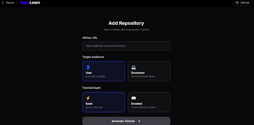
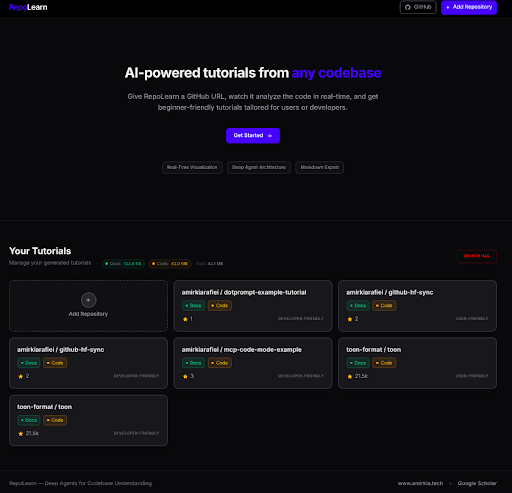
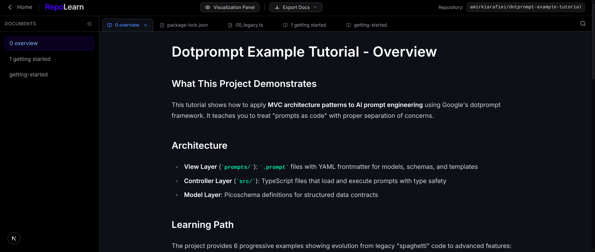
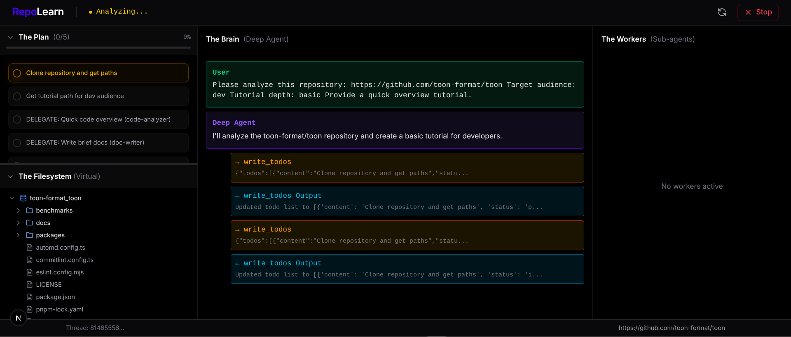
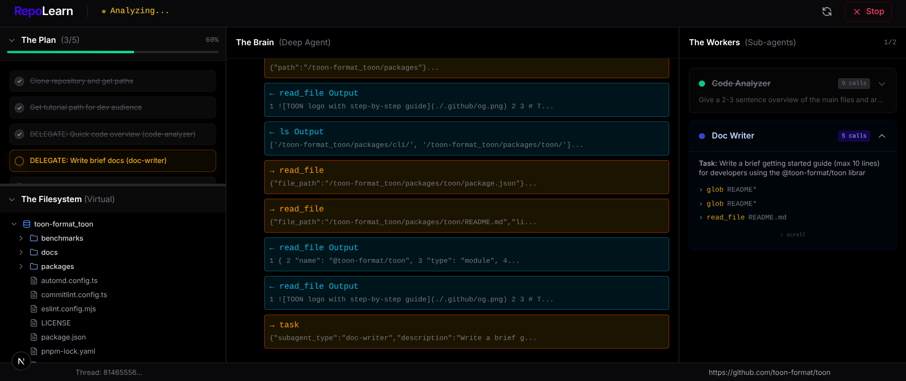

# RepoLearn

**Deep Agent Tutorials with Full Observability** — Give RepoLearn a GitHub URL and watch a transparent, hierarchical team of agents explore and analyze the codebase in real-time. Our advanced **Deep Agent Visualization Dashboard** reveals the agents' thoughts, planning, and actions as they generate tutorials.

Built with **Radical Transparency** and **Agents 2.0** for intelligent codebase understanding.

### Dashboard & Workflow

<table width="100%">
  <tr>
    <td width="33%" align="center">
      
      <br/><b>Figure 1:</b> <b>Entry Point.</b> Initiate tutorial generation by providing any public GitHub repository URL.
    </td>
    <td width="33%" align="center">
      
      <br/><b>Figure 2:</b> <b>Tutorial Library.</b> The main landing page showcasing the collection of generated tutorials as interactive cards.
    </td>
    <td width="33%" align="center">
      
      <br/><b>Figure 5:</b> <b>Artifact Generation.</b> The final output: high-fidelity, dual-audience tutorials formatted in Markdown.
    </td>
  </tr>
  <tr>
    <td colspan="3" align="center">
      
      <br/><b>Figure 3:</b> <b>Analysis Inception.</b> The initial phase of the visualization dashboard where planning begins.
    </td>
  </tr>
  <tr>
    <td colspan="3" align="center">
      
      <br/><b>Figure 4:</b> <b>Multidimensional Observability.</b> Radical transparency across the four agentic pillars: Spatial, Hierarchical, Temporal, and Cognitive.
    </td>
  </tr>
</table>

## Quick Start

### Prerequisites
- Node.js 18+
- Python 3.12+
- [LangGraph CLI](https://langchain-ai.github.io/langgraph/tutorials/langgraph-platform/local-server/) (`uv tool install langgraph-cli[inmem]`)
- OpenRouter API key ([get one here](https://openrouter.ai/))

### 1. Clone & Setup

```bash
git clone https://github.com/amirkiarafiei/repo-learn.git
cd repo-learn
```

### 2. Backend Setup

```bash
cd backend
uv sync

# Copy and configure environment
cp .env.example .env
# Edit .env and add your OPENROUTER_API_KEY

# Start the LangGraph server
langgraph dev --port 2024
```

### 3. Frontend Setup (new terminal)

```bash
cd frontend
npm install

# Copy environment (optional, defaults work for local dev)
cp .env.example .env.local

# Start Next.js dev server
npm run dev
```

### 4. Open the App

Navigate to **http://localhost:3000** and enter a GitHub repository URL to generate your first tutorial!

## Quick Run Script

Alternatively, run both services at once (requires `gnome-terminal` or `xterm`):

```bash
./run.sh
```

## Features

- 🧠 **Deep Agent Architecture** — Hierarchical AI agents for intelligent analysis
- 📊 **Real-Time Visualization** — Watch the agent think and plan live
- 📝 **Dual Audience Mode** — Tutorials for end-users or developers
- 📁 **Interactive IDE** — Browse source code with syntax highlighting
- 📤 **Export to Markdown/PDF** — Download tutorials as zip archives

## Research

This repository contains the official implementation for our research on **Automated Codebase Comprehension**. The tool demonstrates how hierarchical Deep Agents can autonomously navigate and explain complex repositories while maintaining full transparency through our real-time visualization dashboard.

## License

MIT

## Citation

If you use this work in your research, please cite:

```bibtex
@article{rafiei2026repolearn,
  title={RepoLearn: Automated Codebase Comprehension through Multidimensional Deep Agent Observability},
  author={Rafiei, Amirikia},
  journal={arXiv preprint},
  year={2026}
}
```