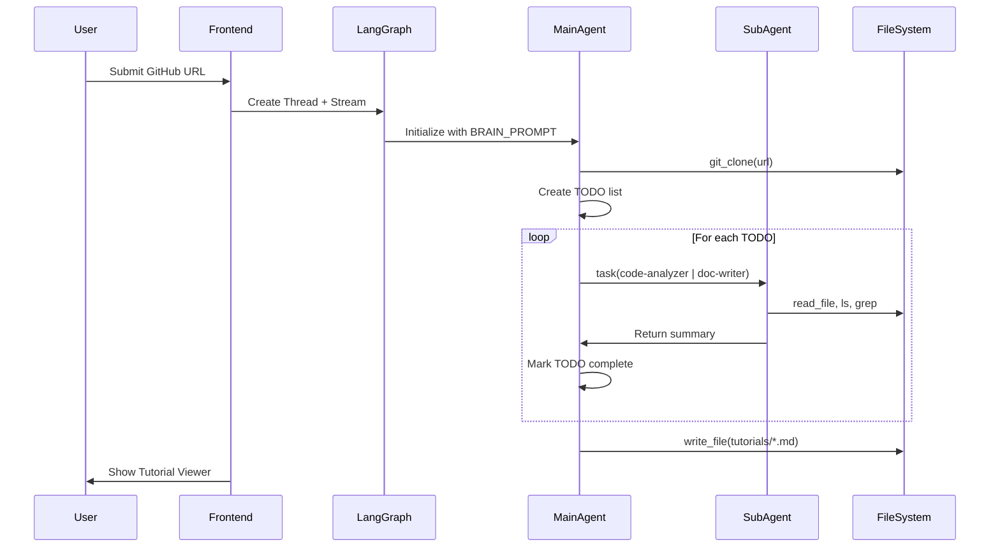

# RepoLearn - Current Progress & Status

**Last Updated:** December 28, 2024  
**MVP Status:** ✅ Complete (Phases 0-7)

---

## 🎉 What We've Built

RepoLearn is a fully functional MVP demonstrating the **Deep Agent methodology** for codebase understanding. The system uses hierarchical AI agents to analyze GitHub repositories and generate beginner-friendly tutorials.

---

## ✅ Completed Features

### Phase 0: Project Setup
- [x] Monorepo structure (`frontend/`, `backend/`, `data/`)
- [x] Environment configuration (`.env` files)
- [x] LangGraph server configuration (`langgraph.json`)

### Phase 1: Backend Agent Engine
- [x] DeepAgent configuration with `create_deep_agent`
- [x] OpenRouter LLM integration (`ChatOpenAI` wrapper)
- [x] FilesystemBackend for repository access
- [x] Custom tools: `git_clone`, `get_repo_path`, `get_tutorial_path`
- [x] TodoListMiddleware integration (task planning)

### Phase 2: Sub-agent System
- [x] **code-analyzer** subagent - Deep code analysis
- [x] **doc-writer** subagent - Tutorial content generation
- [x] SubAgentMiddleware with `task` tool delegation
- [x] Mandatory dual-agent usage in BRAIN_PROMPT

### Phase 3: Frontend Foundation
- [x] Next.js 15 with App Router
- [x] Tailwind CSS v4 with typography plugin
- [x] Custom `useAgentStream` hook wrapping LangGraph SDK
- [x] Thread management and message transformation

### Phase 4: Live Progress UI (3-Panel Layout)
- [x] **PlannerPanel** - TODO list with progress bar
- [x] **BrainPanel** - Agent thought stream with color-coded messages
- [x] **GridPanel** - Sub-agent cards with accordion expansion
- [x] Real-time streaming from LangGraph server
- [x] Status badges and completion indicators

### Phase 5: Tutorial Storage & Display
- [x] Tutorial API routes (`/api/tutorials`, `/api/tutorials/[id]`)
- [x] Storage API with size stats (`/api/storage`)
- [x] Delete operations (tutorial + cache, cache only)
- [x] Markdown file reading and serving

### Phase 6: Tutorial Viewer
- [x] Collapsible sidebar navigation
- [x] Markdown rendering with `react-markdown` + `remark-gfm`
- [x] Tailwind Typography plugin for prose styling
- [x] Back button navigation

### Phase 7: Premium Polish
- [x] Animated gradient backgrounds
- [x] Glassmorphism effects (`.glass` class)
- [x] Skeleton loading states (`.skeleton` shimmer)
- [x] Toast notification system with slide animations
- [x] Stagger children animations
- [x] Hover-lift effects on cards
- [x] Gradient text for branding
- [x] Progress bars with smooth transitions
- [x] Typing cursor animations

---

## 🏗️ System Architecture (Implemented)

```
repo-learn/
├── frontend/                    # Next.js 15 Application
│   ├── src/
│   │   ├── app/
│   │   │   ├── page.tsx         # Home with Your Tutorials
│   │   │   ├── new/page.tsx     # Add Repository form
│   │   │   ├── job/[id]/page.tsx # Live Progress (3-Panel)
│   │   │   ├── tutorial/[id]/page.tsx # Tutorial Viewer
│   │   │   └── api/             # API Routes
│   │   │       ├── tutorials/   # Tutorial listing/content
│   │   │       └── storage/     # Storage stats & delete
│   │   ├── components/
│   │   │   ├── PlannerPanel.tsx # TODO list panel
│   │   │   ├── BrainPanel.tsx   # Agent stream panel
│   │   │   ├── GridPanel.tsx    # Sub-agent cards panel
│   │   │   └── Toast.tsx        # Notification system
│   │   └── hooks/
│   │       └── useAgentStream.ts # LangGraph SDK wrapper
│   └── globals.css              # Premium animations
├── backend/
│   ├── agent/
│   │   ├── graph.py             # Main DeepAgent configuration
│   │   ├── tools.py             # Custom tools
│   │   └── subagents.py         # Sub-agent definitions
│   └── langgraph.json           # Server configuration
└── data/
    ├── repositories/            # Cloned repos (cache)
    └── tutorials/               # Generated markdown files
```

---

## 🔄 Data Flow



---

## 🚧 Not Implemented (Future Scope)

These features were designed but intentionally deferred for the MVP:

### From SRS (Optional Enhancements)

| Feature                        | Status     | Notes                                             |
| ------------------------------ | ---------- | ------------------------------------------------- |
| Cost Estimation & Live Metrics | ⏳ Deferred | Pre-flight token counting, real-time cost display |
| Resumability & Checkpointing   | ⏳ Deferred | Skip already-completed phases on restart          |
| Manager/Supervisor Agent       | ⏳ Deferred | QA layer above the Deep Agent                     |
| Semantic Status Updates        | ⏳ Deferred | Human-readable sub-agent status                   |
| Conversational Center Panel    | ⏳ Deferred | Chat-style agent dialogue visualization           |
| Edit Mode in Viewer            | ⏳ Deferred | Manual correction of generated content            |

### Technical Debt & Improvements

| Item                      | Priority | Description                                 |
| ------------------------- | -------- | ------------------------------------------- |
| Activity Log Population   | Medium   | Sub-agent logs only show "Started" message  |
| Parallel Sub-agents       | Low      | Currently sequential, could run in parallel |
| Error Recovery            | Medium   | Better handling of LLM/API failures         |
| Production Deployment     | High     | Docker, Postgres checkpointing, env configs |
| Test Coverage             | Medium   | Unit/integration tests for agent logic      |
| Mermaid Diagram Rendering | Low      | Add rehype-mermaid for diagram support      |

---

## 🔑 Key Implementation Decisions

### 1. OpenRouter as LLM Provider
We chose OpenRouter for model flexibility. The `ChatOpenAI` wrapper connects to OpenRouter's API:
```python
model = ChatOpenAI(
    model="google/gemini-2.0-flash-001",
    openai_api_base="https://openrouter.ai/api/v1",
    openai_api_key=OPENROUTER_API_KEY,
)
```

### 2. Mandatory Dual Sub-agent Usage
The BRAIN_PROMPT enforces use of BOTH sub-agents:
- **code-analyzer**: Deep technical analysis
- **doc-writer**: User-friendly documentation

This demonstrates the hierarchical delegation pattern central to our research thesis.

### 3. Frontend-Backend Streaming Architecture
- LangGraph Server runs on port 2024
- Frontend uses `useStream` hook from `@langchain/langgraph-sdk/react`
- Custom `useAgentStream` wrapper extracts todos, messages, and subagent status
- Stream modes: `["messages", "updates"]` with `subgraphs=true`

### 4. File-Based Tutorial Storage
Tutorials are stored as markdown files in `data/tutorials/{repo_name}/user/`:
- Enables easy editing and version control
- API routes serve files to the frontend
- Storage stats calculated recursively

### 5. Premium UI Polish
CSS animations create a "wow factor":
- Gradient shifts for hero sections
- Glassmorphism for headers and panels
- Stagger animations for list items
- Toast notifications for user feedback

---

## 📊 Metrics & Usage

### Storage Structure
- **Tutorials**: `~50-200KB` per repository
- **Cache (Cloned Repos)**: `~1-50MB` per repository
- **Total Typical Usage**: `10-100MB` for 10 repos

### Typical Token Usage (Estimated)
- Small repo (~1000 LOC): `~5K-10K` tokens
- Medium repo (~10K LOC): `~20K-50K` tokens
- Large repo (~100K LOC): `~100K-500K` tokens

---

## 🚀 How to Run

### Prerequisites
- Node.js 18+
- Python 3.11+
- LangGraph CLI (`pip install langgraph-cli`)

### Quick Start
```bash
# Backend
cd backend
pip install -r requirements.txt
langgraph dev --port 2024

# Frontend (new terminal)
cd frontend
npm install
npm run dev
```

Access at: http://localhost:3000

---

## 📚 Related Documentation

- [DeepAgent Q&A Reference](./deepagent_qa.md) - Technical API details
- [Agent Strategy](./design/agent_strategy.md) - Analyst-Architect methodology
- [Software Requirements](./design/design_srs.md) - Full system specification

---

## 🎯 Next Steps for Production

1. **Deployment**: Containerize with Docker, add Postgres for checkpoints
2. **Authentication**: Add user accounts for private tutorials
3. **Rate Limiting**: Protect against API abuse
4. **Monitoring**: Add observability (metrics, logs, traces)
5. **Testing**: Add E2E tests with Playwright
6. **Documentation**: Generate API docs with OpenAPI

---

*RepoLearn v0.1.0 MVP - Deep Agents for Codebase Understanding*
