# A Basic Implementation of Sub-Agents Architecture
This document outlines a basic implementation of the sub-agents architecture methodology using the Smolagents framework. While some other frameworks such as Langchain provide built-in support for sub-agents very recently and offer more advanced features, our implementation will be a simplified version to demonstrate the core concepts.

## Overview
In this implementation, we will create a main agent that on-the-fly spawns sub-agents to handle specific tasks to finally generate the knowledge base. The overall flow will be as follows:

1. The loop starts.
2. The main agent is given a codebase (within its workspace) to analyze.
3. The main agent analyzes the codebase and identifies specific tasks that can be delegated to sub-agents.
4. The main agent spawns sub-agents to handle these tasks concurrently.
5. Each sub-agent works on its assigned task and generates a part of the knowledge base and saves the results to a dedicated storage it controls.
6. The subagents report back to the main agent once they complete their tasks and report to the main agent that they have saved the results to their dedicated storage.
7. The main agent reads the synthesized results from the sub-agents' storages and combines them to form the final knowledge base.
8. The main agent writes the final knowledge base to its own storage.
9. The loop is terminated.

Before implementing each single agent and its tools, first lets focus on how can this architecture be used to generate the knowledge base.

## How to generate the knowledge base

lets think of a scneario of a codebase that has structure as follows:

```
my-project/
├── README.md
├── requirements.txt
├── .gitignore
├── config.json
├── main.py
└── src/
    ├── api/
    │   ├── endpoints/
    │   │   ├── users.py
    │   │   ├── products.py
    │   │   └── orders.py
    │   ├── middleware/
    │   │   ├── auth.py
    │   │   └── logging.py
    │   └── __init__.py
    ├── models/
    │   ├── user.py
    │   ├── product.py
    │   ├── order.py
    │   └── database.py
    └── utils/
        ├── helpers.py
        ├── validators.py
        └── constants.py
```

#### 1. Initial Analysis by the Main Agent

The main agent is given a codebase in its workspace to analyze. Initially, it has no clue about the codebase structure:

- It doesn't know what's inside the codebase or what languages/frameworks are used
- It doesn't know the business logic of the codebase or what the code is supposed to do
- It doesn't know the dependencies of the codebase
- It doesn't know file sizes or their importance
- It doesn't know the tree structure of the codebase (directories, subdirectories, files, etc.)

**So at the very initial step, when the agent knows nothing about the codebase, what can it do?**

Multiple techniques can be used here, for example:

- The main agent can start by reading the root directory structure of the codebase to get an overview of the files and directories present. We can give the agent a tool that, when called, returns the root directory structure of the codebase.
- We can also give it a more detailed tool such as `get_tree` that returns the full tree structure of the codebase, including directories, subdirectories, and files.

These two tools are **SUPER USEFUL** at the initial step because they give the agent a high-level overview of the codebase structure, allowing it to identify important files and directories that may require further analysis.

After having an overview of the codebase structure, the main agent can start by reading some important files that are usually present in the codebase, such as `README.md`, `package.json`, or other configuration files, to gain insights into the project structure and dependencies.

Also, the agent may decide to read some of the code files that are starting points or entry points of the codebase, such as `main.py` in Python projects or `index.js` in JavaScript projects, to understand the overall flow of the application. It may also identify other important files to read from the `main.py` imports and dependencies.

Now, after this initial analysis, the main agent should have a basic understanding of the codebase, including its structure, dependencies, and overall purpose. With this knowledge, it can now identify specific tasks that can be delegated to sub-agents for more detailed analysis and knowledge base generation.

### 2. Write a TODO List

One feature that can be very helpful here is to have the main agent write a TODO list of tasks that need to be accomplished to generate the knowledge base.

This TODO list is written and managed by the main agent itself, and it can add or remove tasks from the list as needed.

For example, the TODO list may look like this:

```
- [ ] Analyze the API endpoints and document their functionality.
- [ ] Review the data models and document their relationships.
- [ ] Examine the utility functions and document their purpose.
- [ ] Identify and document any middleware components.
- [ ] Summarize the overall architecture of the codebase.
```

This TODO list serves as a guide for the main agent in long-term planning of the knowledge base generation process. The main agent can refer to this list to determine which tasks have been completed and which ones still need to be addressed. It can also use this list to prioritize tasks and allocate resources accordingly.

This is useful because sometimes when the codebase is too large or complex, the agent may hallucinate or lose its focus on what tasks need to be done. Having a TODO list helps the agent stay organized and on track.

After completing one of the tasks in the TODO list, the agent can mark that task as completed and move on to the next one. This iterative process continues until all tasks in the TODO list have been addressed and the knowledge base is fully generated.

**Implementation options:**

In order to implement this feature, we can create a simple tool that allows the main agent to add, remove, and view tasks in the TODO list. The TODO list tool can be implemented as:

- A simple text file
- A more structured format such as JSON or YAML (depending on the complexity of the tasks and the needs of the project)
- Even a no-op tool that just tells the agent to manage the TODO list in its own memory

**NOTE:** The Smolagents framework has a parameter when creating the agent named `planning` or something similar. This parameter accepts integer values such as 2 or 5. For example, if you set it to 5, the agent will re-evaluate its overall plan and goals after 5 iterations in its loop (for example, after using its tools 5 times), and adjust its strategy accordingly. This can serve a similar purpose as the TODO list, by allowing the agent to periodically review its progress and make adjustments as needed. You can experiment with this parameter in the Smolagents framework using the UI we have implemented in this code template.

**NOTE:** You may decide to implement the TODO list or use the planning parameter of the Smolagents framework. Both approaches are valid and can be used to help the main agent stay organized and focused on its tasks. These two approaches are OPTIONAL, and you are totally free to implement or not implement them based on your preference. However, their implementation can be very helpful in managing the complexity of the knowledge base generation process.

**NOTE: Simplified Planning Approach**
You can also user a much simpler approach for task decomposition instead of implementing a full TODO list or using the planning mechanism of Smolagents.

Instead of implementing intelligent task decomposition, use this deterministic rule:

```
For every first-level directory in src/:
  - Create one sub-agent
  - Task: "Analyze [directory_name] and document it"
```
Example:
If your codebase has:
```
src/
├── api/
├── models/
├── utils/
└── config/
```

Then spawn exactly 4 sub-agents (one for each directory).


### 3. Spawning Sub-Agents for Specific Tasks

#### Understanding Sub-Agents Architecture

This methodology is based on the **Deep Agents** pattern, which is designed for long-horizon tasks like generating comprehensive knowledge bases. You can learn more about this approach in these resources:

- [Deep Agents - Langchain Documentation](https://docs.langchain.com/oss/python/deepagents/subagents)
- [Deep Agents Blog Post](https://blog.langchain.dev/deep-agents/)
- [Deep Agents GitHub Repository](https://github.com/langchain-ai/deepagents)
- [Long-Horizon Tasks Article Series](https://medium.com/@amirkiarafiei/the-agent-2-0-era-mastering-long-horizon-tasks-with-deep-agents-part-1-c566efaa951b)

**Key Concept - "Concurrent from Main Agent's Perspective":**

When we say sub-agents work "concurrently," we don't mean they run in parallel using threads or async programming. Instead, we mean:

- The main agent delegates a task to a sub-agent and **doesn't track what the sub-agent does**
- The main agent's context remains **clean** - it doesn't see the sub-agent's reasoning, tool calls, or intermediate steps
- Sub-agents work **independently** - each has its own context, memory, and workspace
- Sub-agents **save results to persistent storage** (files in their workspace)
- The main agent **reads results later** from the storage, not from the sub-agent's response

This keeps the main agent's context window small and focused, which is crucial for long-horizon tasks.

**Note:** Sub-agents execute one after another (sequentially), not in parallel. This is simpler to implement and avoids threading complexity. It's perfectly fine if the process takes time - quality matters more than speed.

#### How It Works

Once the main agent identifies tasks to delegate, it spawns sub-agents to handle them. For example:

- **Task:** Analyze the API endpoints of the codebase
- **Sub-agent's job:** Read API code files, understand how they work, generate markdown documentation with examples and diagrams
- **Sub-agent saves:** Documentation to its dedicated workspace folder
- **Main agent reads:** The saved documentation file later (not the sub-agent's response)

**Important Rules:**
- Each sub-agent has its **own workspace folder** - it can only write files there
- Sub-agents have **read access to the codebase** - they can read source code files
- Sub-agents **cannot access** the main agent's storage or other sub-agents' workspaces
- The main agent **can read** all sub-agent workspaces after they finish

Lets see a pseudo code with an example of how the main agent can spawn sub-agents for specific tasks:

```python
# Pseudo code for a tool that main agent can use to spawn sub-agents
from smolagents import tool, ToolCallingAgent, LiteLLMModel
from typing import List
import os

@tool
def spawn_sub_agents(number_of_subagents: int, task_descriptions: List[str]) -> str:
    """
    Main agent uses this tool to spawn sub-agents for different tasks.
    Each sub-agent works independently and saves results to its own workspace.
    Sub-agents run one after another (sequentially), not in parallel.

    Args:
        number_of_subagents: How many sub-agents to create
        task_descriptions: List of tasks, one for each sub-agent

    Returns:
        A summary telling main agent where to find the results
    """
    results = []

    # Step 1: Create a workspace directory for all sub-agents
    sub_agents_workspace = "sub_agents_workspace"
    os.makedirs(sub_agents_workspace, exist_ok=True)

    # Step 2: Create and run each sub-agent one by one
    for i in range(number_of_subagents):
        # Create a dedicated folder for this sub-agent
        sub_agent_workspace = os.path.join(sub_agents_workspace, f"sub_agent_{i}")
        os.makedirs(sub_agent_workspace, exist_ok=True)

        # Get this sub-agent's task
        task = task_descriptions[i]

        # Create tools for this sub-agent
        # These tools allow the sub-agent to:
        # - Read files from the codebase (read-only)
        # - Write files to its own workspace (read-write)
        codebase_path = "my_project"  # Path to the codebase being analyzed
        sub_agent_tools = create_scoped_tools(sub_agent_workspace, codebase_path)

        # Create the sub-agent (same way we create any agent in Smolagents)
        model = LiteLLMModel(model_id=os.getenv("LITELLM_MODEL_ID"))
        sub_agent = ToolCallingAgent(
            tools=sub_agent_tools,
            model=model
        )

        # Run the sub-agent and let it complete its task
        # This may take time (minutes), but that's okay
        # The sub-agent will save its results to its workspace
        result = sub_agent.run(task)

        # Store information about this sub-agent's work
        results.append({
            "sub_agent_id": i,
            "task": task,
            "workspace": sub_agent_workspace,
            "result": result  # Summary of what the sub-agent did
        })

    # Step 3: Return a summary to the main agent
    # The main agent doesn't see the sub-agents' detailed work,
    # just where to find the saved results
    summary = f"All {number_of_subagents} sub-agents completed their tasks.\n"
    summary += "Results saved in the following workspaces:\n"
    for res in results:
        summary += f"  - Sub-agent {res['sub_agent_id']}: {res['workspace']}\n"

    return summary


def create_scoped_tools(workspace_path: str, codebase_path: str):
    """
    Helper function to create tools that are scoped to specific directories.
    This ensures sub-agents can only:
    - Read from the codebase (to analyze source code)
    - Write to their own workspace (to save results)

    Args:
        workspace_path: Where this sub-agent saves its work
        codebase_path: Where the source code to analyze is located

    Returns:
        List of tools for the sub-agent
    """
    # Students will implement these scoped tools
    # Each tool restricts file access to allowed directories

    # Example tools you might create:
    # 1. read_codebase_file(file_path) - Reads a file from codebase_path
    # 2. write_workspace_file(file_path, content) - Writes to workspace_path
    # 3. list_codebase_directory(dir_path) - Lists files in codebase
    # 4. get_codebase_tree() - Gets full tree structure of codebase

    return [
        read_codebase_file,       # Read source code
        write_workspace_file,      # Save analysis results
        list_codebase_directory,   # Explore codebase structure
        get_codebase_tree         # Get overview of codebase
    ]
```

#### Example Usage Scenario

Here's how the main agent would use this tool:

```python
# Main agent decides to delegate two tasks
task_descriptions = [
    "Review the my_project/src/api/ folder and write markdown documentation explaining how it works. Include mermaid diagrams showing the API structure. Save the result as 'api_documentation.md'.",
    "Summarize the utility functions in my_project/src/utils/ folder. Include code examples and save as 'utils_summary.md'."
]

# Main agent calls the tool
result = spawn_sub_agents(number_of_subagents=2, task_descriptions=task_descriptions)

# The tool returns something like:
# "All 2 sub-agents completed their tasks.
#  Results saved in the following workspaces:
#    - Sub-agent 0: sub_agents_workspace/sub_agent_0/
#    - Sub-agent 1: sub_agents_workspace/sub_agent_1/"

# Now the main agent can read the saved files:
# - sub_agents_workspace/sub_agent_0/api_documentation.md
# - sub_agents_workspace/sub_agent_1/utils_summary.md
```

**What happens step by step:**

1. **Sub-agent 0 works:**
   - Reads files from `my_project/src/api/`
   - Analyzes the code
   - Creates documentation with mermaid diagrams
   - Saves `api_documentation.md` to `sub_agents_workspace/sub_agent_0/`
   - Reports: "Done! I saved it to my workspace."

2. **Sub-agent 1 works:**
   - Reads files from `my_project/src/utils/`
   - Identifies key utility functions
   - Creates summary with code examples
   - Saves `utils_summary.md` to `sub_agents_workspace/sub_agent_1/`
   - Reports: "Done! I saved it to my workspace."

3. **Main agent continues:**
   - Reads both markdown files from sub-agent workspaces
   - Combines them into the final knowledge base
   - The main agent never saw the sub-agents' reasoning or tool calls - only the final results!

#### Workflow Visualization


**Key Points:**

- **Main Agent** (blue) orchestrates the entire process
- **Codebase** (red) is accessible by all sub-agents for reading source code
- **Sub-Agents** (yellow) work independently (one after another, not in parallel)
- **Workspaces** (purple) keep each sub-agent's outputs isolated (write access only)
- **Final Knowledge Base** (green) is created by combining all sub-agent outputs

### 4. Using Pre-Built Agent Types (Optional Enhancement)

The basic approach above lets the main agent define tasks freely. But you can make sub-agents even more effective by creating **pre-built agent types**.

**The Problem:** The main agent's task description might be too vague. For example:
- "Analyze the API folder" - How detailed should it be? What format? What diagrams?

**The Solution:** Create agent types with detailed instructions built-in.

**Example Agent Types:**

1. **AnalyzerAgent** - For detailed code analysis
   - Knows how to read code systematically
   - Always creates mermaid diagrams
   - Uses a specific markdown template
   - Includes code examples with syntax highlighting

2. **SummarizerAgent** - For concise summaries
   - Focuses on key points only
   - Creates bullet-point lists
   - Extracts main functions and their purposes

**How It Works:**
- You write a detailed prompt for each agent type (once)
- The main agent picks an agent type and adds a specific task
- The sub-agent gets: **Pre-written instructions + Main agent's task**
- This ensures consistent, high-quality results

Here's an example implementation:

```python
# Pre-built agent type with specialized prompt
from smolagents import tool, ToolCallingAgent, LiteLLMModel
from typing import List, Literal
import os

# Pre-built prompts for different agent types
# These provide detailed instructions so sub-agents produce consistent results

ANALYZER_AGENT_PROMPT = """
You are a code analyzer agent. Follow these steps:

1. Read all files in the assigned directory
2. Understand what the code does and how components relate
3. Create markdown documentation with:
   - Overview of the directory's purpose
   - Explanation of each major component
   - Mermaid diagram showing architecture
   - Code examples with explanations
4. Save your documentation as a .md file in your workspace
5. Use clear headings, code blocks, and formatting

Your specific task: {TASK_FROM_MAIN_AGENT}
"""

SUMMARIZER_AGENT_PROMPT = """
You are a summarization agent. Follow these steps:

1. Read the assigned files or directory
2. Extract the main functionality and purpose
3. Create a concise summary in markdown with:
   - Brief overview
   - List of key functions/classes
   - Important patterns or conventions
   - Quick code examples
4. Save your summary as a .md file in your workspace

Your specific task: {TASK_FROM_MAIN_AGENT}
"""

@tool
def spawn_typed_sub_agents(
    number_of_subagents: int,
    task_descriptions: List[str],
    agent_types: List[Literal["analyzer", "summarizer"]]
) -> str:
    """
    Same as spawn_sub_agents, but uses pre-built agent types.
    Each type has detailed instructions built-in.

    Args:
        number_of_subagents: How many sub-agents to create
        task_descriptions: List of specific tasks
        agent_types: Type for each agent ("analyzer" or "summarizer")

    Returns:
        Summary of where results are saved
    """
    results = []

    # Map agent types to their prompts
    agent_prompts = {
        "analyzer": ANALYZER_AGENT_PROMPT,
        "summarizer": SUMMARIZER_AGENT_PROMPT
    }

    sub_agents_workspace = "sub_agents_workspace"
    os.makedirs(sub_agents_workspace, exist_ok=True)

    for i in range(number_of_subagents):
        sub_agent_workspace = os.path.join(sub_agents_workspace, f"sub_agent_{i}")
        os.makedirs(sub_agent_workspace, exist_ok=True)

        # Get the agent type and task for this sub-agent
        agent_type = agent_types[i]
        task = task_descriptions[i]

        # Combine pre-built prompt with specific task
        full_prompt = agent_prompts[agent_type].replace("{TASK_FROM_MAIN_AGENT}", task)

        # Create scoped tools for this sub-agent with codebase access
        codebase_path = "my_project"
        sub_agent_tools = create_scoped_tools(sub_agent_workspace, codebase_path)

        # Create the sub-agent with specialized instructions
        model = LiteLLMModel(model_id=os.getenv("LITELLM_MODEL_ID"))
        sub_agent = ToolCallingAgent(
            tools=sub_agent_tools,
            model=model,
            instructions=full_prompt  # Use instructions parameter for the prompt
        )

        # Run the sub-agent with the combined prompt
        result = sub_agent.run(full_prompt)

        results.append({
            "sub_agent_id": i,
            "agent_type": agent_type,
            "task": task,
            "workspace": sub_agent_workspace,
            "result": result
        })

    summary = f"Spawned {number_of_subagents} typed sub-agents.\n"
    for res in results:
        summary += f"\nSub-agent {res['sub_agent_id']} ({res['agent_type']}): Task completed. Workspace: {res['workspace']}\n"

    return summary
```

#### Example Usage with Pre-Built Agent Types

```python
# Main agent specifies tasks AND agent types
task_descriptions = [
    "Analyze the my_project/src/api/ folder",
    "Summarize the my_project/src/utils/ folder"
]

agent_types = ["analyzer", "summarizer"]

result = spawn_typed_sub_agents(
    number_of_subagents=2,
    task_descriptions=task_descriptions,
    agent_types=agent_types
)
```

**What each sub-agent receives:**

- **Sub-agent 0 (Analyzer):**
  - Gets: `ANALYZER_AGENT_PROMPT` + "Analyze the my_project/src/api/ folder"
  - Knows: Create detailed docs with mermaid diagrams and code examples
  - Result: Comprehensive analysis with consistent format

- **Sub-agent 1 (Summarizer):**
  - Gets: `SUMMARIZER_AGENT_PROMPT` + "Summarize the my_project/src/utils/ folder"
  - Knows: Create concise bullet-point summary
  - Result: Quick reference guide

**Benefits:**
- Main agent only provides high-level tasks
- Pre-built prompts ensure quality and consistency
- You can create more agent types as needed (e.g., DiagramAgent, APIDocAgent)

#### Workflow Visualization with Pre-Built Agent Types

```mermaid
flowchart TD
    A[Main Agent] -->|Calls spawn_typed_sub_agents| B[Tool: spawn_typed_sub_agents]

    B -->|Selects type: analyzer| C[ANALYZER_AGENT_PROMPT]
    B -->|Selects type: summarizer| D[SUMMARIZER_AGENT_PROMPT]

    C -->|+ Task 1| E["Full Prompt 1\n(Pre-built + Task)"]
    D -->|+ Task 2| F["Full Prompt 2\n(Pre-built + Task)"]

    E -->|Creates| G[Sub-Agent 0<br/>Analyzer Type]
    F -->|Creates| H[Sub-Agent 1<br/>Summarizer Type]

    G -->|Works in| I[sub_agent_0/]
    H -->|Works in| J[sub_agent_1/]

    G -->|Detailed Analysis| K["📄 api_documentation.md<br/>✓ Mermaid diagrams<br/>✓ Code examples<br/>✓ Architecture docs"]
    H -->|Concise Summary| L["📄 utils_summary.md<br/>✓ Key functions<br/>✓ Usage patterns<br/>✓ Quick reference"]

    K -->|Saved in| I
    L -->|Saved in| J

    I -->|Read by| M[Main Agent]
    J -->|Read by| M

    M -->|Combines| N[Final Knowledge Base]

    style A fill:#e1f5ff,stroke:#333,stroke-width:3px
    style C fill:#ffe0b2,stroke:#333,stroke-width:2px
    style D fill:#ffe0b2,stroke:#333,stroke-width:2px
    style G fill:#fff4e1,stroke:#333,stroke-width:2px
    style H fill:#fff4e1,stroke:#333,stroke-width:2px
    style N fill:#e8f5e9,stroke:#333,stroke-width:3px
    style E fill:#f9fbe7,stroke:#333,stroke-width:1px,stroke-dasharray: 5 5
    style F fill:#f9fbe7,stroke:#333,stroke-width:1px,stroke-dasharray: 5 5
```



**Key Advantages:**
- **Pre-Built Prompts** (orange) provide expert instructions for each agent type
- **Combined Prompts** (dashed boxes) merge general instructions with specific tasks
- **Typed Sub-Agents** (yellow) have specialized capabilities based on their type
- **Consistent Output** - Each agent type produces predictable, high-quality results
- **Flexibility** - Main agent only provides high-level tasks, pre-built prompts handle the details


### 5. Combining Sub-Agent Results into Final Knowledge Base

After all sub-agents have completed their tasks and saved their results to their dedicated workspaces, the main agent's final step is to read these results and combine them into a comprehensive knowledge base. The main agent can use simple file reading tools to access the saved markdown files or other documentation generated by each sub-agent. It can then aggregate this information, format it as needed, and store it in its own storage for future reference. This final knowledge base will serve as a valuable resource for understanding the codebase and its components.

Similar to DeepWiki, the knowledge base should consist of multiple markdown files, each file representing a specific part of the codebase or a specific topic. As shown in the DeepWiki (image below), the knowledge base can be organized into sections and subsections, with links between related topics for easy navigation.


## Downstream Applications

Once the knowledge base is generated using the sub-agents architecture, it can be utilized for various downstream applications.

### For "Ara Proje" Group

Use a simple LLM/Agent that reads the knowledge base markdown files and generates a tutorial (in the form of markdown files) that teaches new developers how to use the codebase effectively. It should include code examples, diagrams, and more.

Your output should look similar to this:
[PocketFlow Tutorial Codebase Knowledge](https://github.com/The-Pocket/PocketFlow-Tutorial-Codebase-Knowledge)

### For "Final Proje" Group

You should build a Q&A agent that uses the knowledge base to answer questions about the codebase through a simple GUI (the existing GUI in this code template is enough). The agent should be able to:

- Read the markdown files in the knowledge base
- Access the codebase files if needed to provide accurate answers

**To improve accuracy:**

- You can index the codebase files using vector databases such as FAISS or ChromaDB
- Use retrieval-augmented generation (RAG) techniques to fetch relevant information from the codebase when answering questions
- You can also use pre-made frameworks that provide RAG such as [Haystack](https://haystack.deepset.ai/)

