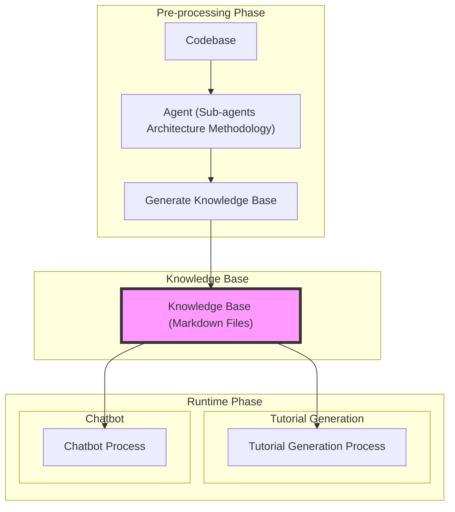
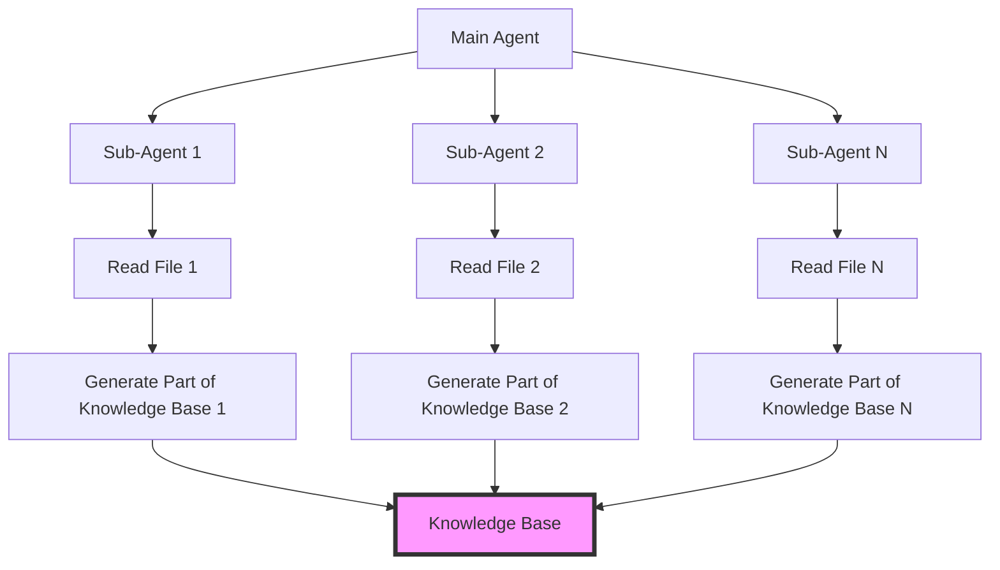
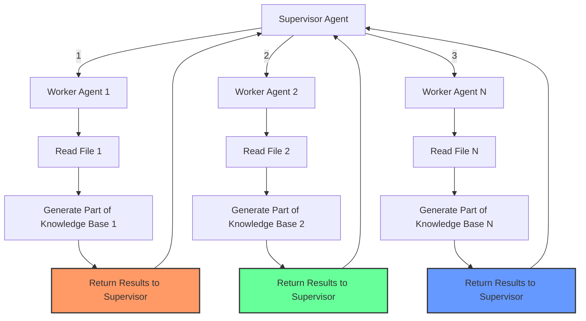

# Our Goal in This Project

From a high-level perspective, given a codebase in any language, we want to design and develop a system that can generate a knowledge base of that codebase. This knowledge base can then be used for various downstream tasks such as code generation, code explanation, code debugging, and more.

By **knowledge base**, we mean a set of static, pre-built markdown files that explain the codebase in a structured and detailed way, similar to what we see in [DeepWiki](https://deepwiki.org/).

## Downstream Tasks

### Task for "Ara Proje" Group

Generate a tutorial in the form of multiple markdown files that explains how the codebase works and how to use it. This tutorial should be:

- **Beginner-friendly** and cover all important aspects of the codebase
- Useful for both junior developers new to the codebase and senior developers who want to get up to speed quickly
- Contains real or example code snippets, explanations, diagrams (ASCII art or preferably Mermaid), and other relevant information

**Implementation approach:**
These markdown files should be generated using the knowledge base created from the codebase and retrieving code snippets from the codebase itself using a **custom retrieval mechanism** (such as the agent opening code files dynamically **while generating the tutorial**). Optionally, RAG can also be used for this purpose.

### Task for "Final Proje" Group

Design a chatbot that users can interact with to ask questions about the codebase. The chatbot should be able to:

- Answer questions about the codebase
- Provide code snippets
- Explain how certain parts of the codebase work
- Help users navigate the codebase effectively

**Implementation approach:**
This chatbot should understand natural language queries and provide accurate and relevant responses using **BOTH** the **knowledge base** generated from the codebase AND retrieving code snippets from the codebase itself using either **RAG or a custom retrieval mechanism** (such as the agent opening code files dynamically).

## Expected Output

### "Ara Proje" Output

A set of markdown files that explain the codebase in a structured way without any chatbot GUI. A very simple UI that accepts the URL of a GitHub repository (or a local path to the codebase) as user input and generates and saves the markdown files on the local machine is sufficient.

### "Final Proje" Output

A chatbot GUI that users can interact with to ask questions about the codebase.

### Important Note for Both Projects

**IN BOTH CASES, THE KNOWLEDGE BASE MUST BE GENERATED FIRST AND THEN USED FOR THE DOWNSTREAM TASK.**

- The knowledge base must **NOT** be generated on-the-fly during the downstream task
- The knowledge base is an **intermediate step** that both projects must implement and use

A mermaid diagram showing the pre-processing phase with sub-agents architecture for knowledge base generation, followed by the knowledge base as a common intermediate step, and then the runtime phase with two subgraphs for tutorial generation and chatbot:

The pre-processing phase involves the agent using a sub-agents architecture methodology to generate the knowledge base from the codebase. The knowledge base is then used as a common intermediate step for both the tutorial generation process and the chatbot process in the runtime phase.

## Methodology: Sub-agents Architecture
To generate the knowledge base from the codebase, we will use a sub-agents architecture methodology. Before diving into the details of this methodology, let's first understand in order to generate the knowledge base, what options we have, what are their pros and cons, and why we chose this particular methodology.

Here we compare three different methodologies for generating the knowledge base from the codebase and discuss their pros and cons and why we chose the sub-agents architecture methodology.
We do not use options 1 and 2 because of their limitations discussed below. We only use option 3: Sub-agents Architecture Methodology. However, we discuss all three options so you can better understand the trade-offs and why we chose this particular methodology.

### Option 1: Monolithic Agent or LLM
#### 1.1: Single LLM

Let's say we want to use a single LLM. In this approach, we have to linearly feed the whole codebase to the LLM as a single prompt or in multiple sequential prompts. In either case, the LLM has to process the entire codebase in a single context window and generate the knowledge base either in a single output or in multiple sequential outputs.

**Challenge:** This is not feasible for large codebases that exceed the context window of the LLM. Even for small codebases, this approach is not efficient because the LLM has to process the entire codebase in a single context window, which can lead to hallucination, distraction, and loss of important information.

#### 1.2: Single Agent with Tool Use

In this approach, we use a single agent that can utilize external tools, such as a `read_file` tool, to read the codebase files one by one and generate the knowledge base incrementally. In this approach, the agent can decide the order of reading files based on its own strategy and generate the knowledge base accordingly. This is better than the previous approach because it allows for more flexibility and efficiency in processing the codebase—the agent can focus on one file at a time and use its own judgment to determine the most relevant information to include in the knowledge base.

**Challenge:** However, this approach still has limitations. The single agent has to manage the entire process of reading files, understanding code, and generating the knowledge base, which can be overwhelming and lead to suboptimal results. The agent may also struggle to maintain context and coherence across multiple files, leading to a disjointed knowledge base. **Most importantly**, the agent still has a context window limitation (the context window limitation of the LLM it uses). When the codebase is large, the agent cannot read ALL files even one by one because the cumulative context of all files read so far may exceed the context window of the LLM used by the agent.

### Option 2: Multi-Agent System

In this approach, we use multiple agents that can work together to read the codebase files and generate the knowledge base. Each agent can be responsible for a specific part of the codebase or a specific task, such as reading files, understanding code, or generating the knowledge base. The agents can communicate and collaborate with each other to achieve the overall goal of generating the knowledge base.

For example, we can have a manager agent that coordinates the work of multiple worker agents. Each worker agent can be responsible for reading a specific directory or a set of files, understanding the code, and generating a part of the knowledge base. The manager agent can then collect the outputs from the worker agents and combine them to form the final knowledge base.

This solves the context window limitation of the previous approaches, as each agent can work within its own context window and focus on a specific part of the codebase.

**Challenges:** This approach is currently widely used and is feasible for large codebases. However, the challenges are:

- **Communication complexity:** Communication and coordination between agents can be complex and may lead to inefficiencies or errors.
- **Context accumulation:** Whenever a worker agent finishes its task, it needs to communicate its results to the manager agent. If the codebase is too large, even a single worker agent may not be able to read all its assigned files within the context window limit of the LLM it uses. Also, if we increase the number of worker agents, these worker agents have to return their results to the manager agent, and the cumulative context of all results returned so far may exceed the context window of the LLM used by the manager agent.
- **Fixed agent count:** The most important challenge is that before we start the process, we need to decide how many worker agents we need based on the size of the codebase. In multi-agent systems, the number of agents is fixed before the process starts. However, in our case, the size of the codebase may vary significantly, and we may not know in advance how many agents we need to effectively process the codebase. This can lead to either underutilization or overutilization of agents, resulting in inefficiencies and suboptimal results.
- **Sequential delegation:** Another minor challenge is that the supervisor can delegate a task to a single worker agent at a time. Usually, it cannot assign tasks to multiple worker agents in parallel.

### Option 3: Sub-agents Architecture Methodology

In this approach, we use a single main agent (manager agent) that can dynamically create and manage sub-agents at runtime. Each sub-agent can be responsible for reading a specific file, understanding the code, and generating a part of the knowledge base. Each sub-agent is created at runtime by the main agent whenever needed and is destroyed after its task is completed. Each sub-agent has its own memory, its own workspace, and its own access to only a specific part of the codebase (for example, a single directory) that is assigned to it by the main agent.

### Analogy: Comparing Multi-Agent Systems vs Sub-Agents Architecture

To better understand the difference between multi-agent systems and sub-agents architecture, let's consider an analogy:

**Multi-Agent System:**
Like a company with multiple employees (agents) who have fixed roles and responsibilities. The number of employees is fixed, and they work together to achieve the company's goals. Whenever an employee finishes their task, they report back to the manager (supervisor agent) who oversees the entire operation. The manager has to review the results of the first employee before assigning the next task to another employee.

**Sub-Agents Architecture:**
Like a freelance project where a project manager (main agent) hires freelancers (sub-agents) on demand to complete specific tasks. The project manager can hire as many freelancers as needed based on the project's requirements. Each freelancer works independently on their assigned task and delivers the results back to the project manager. Once the task is completed, the freelancer is no longer needed and can be let go.

### Wrap-Up

The sub-agents architecture methodology combines the advantages of both previous approaches while mitigating their challenges. It allows for dynamic allocation of resources based on the size and complexity of the codebase, enabling efficient processing without being constrained by fixed numbers of agents or context window limitations. The main agent can create sub-agents as needed, allowing for parallel processing of files and better management of context and coherence across the knowledge base. This methodology is well-suited for generating a comprehensive and structured knowledge base from large and complex codebases.

**Diagram:** A main agent creating multiple sub-agents at runtime to read files from a codebase and generate a knowledge base:

**Please note:** In this diagram, the main agent dynamically creates multiple sub-agents at runtime to read files from the codebase and generate parts of the knowledge base. This is different from a multi-agent system (which is already implemented in this codebase and is widely used in different frameworks) where the number of agents is fixed before the process starts.

**Key differences:**
- In **multi-agent systems**, the manager delegates a single task to a single worker agent at a time
- In **sub-agents architecture**, the main agent can create multiple sub-agents in parallel to work on different files simultaneously and write the results directly to persistent memory (in our case, the knowledge base) without needing to return the results to the main agent first

**Below is a mermaid diagram showing a multi-agent system with supervisor architecture for comparison:**

Here we show through numbers that the supervisor first delegates to worker 1, worker 1 returns results to supervisor, then supervisor delegates to worker 2, worker 2 returns results to supervisor, and so on. In contrast, in sub-agents architecture, the main agent can create multiple sub-agents in parallel to work on different files simultaneously and write the results directly to persistent memory (in our case, the knowledge base) without needing to return the results to the main agent first.

## How to implement sub-agents
Please refer to the `docs/methodology_implementation.md` file for detailed instructions on how to implement the sub-agents architecture methodology in this project.
